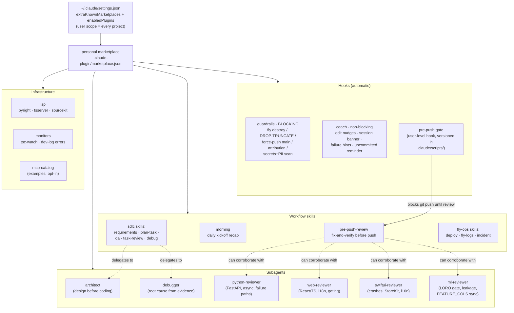
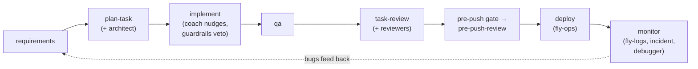

# Personal Claude Code plugins

One source of truth for personal Claude Code tooling across all projects
(RaceModel, f1-predictor, Jarvis, Aura, GT7 Engineer, ...). Registered as the
`personal` marketplace from this local path and enabled by default in
`~/.claude/settings.json`, so every project picks it up automatically.

## How it fits together



The task lifecycle the pieces compose into:



## Plugins

| Plugin | Type(s) | What it does |
|--------|---------|--------------|
| `pre-push-review` | skill | Fix-and-verify review before any `git push` (pairs with the user-level pre-push gate hook). |
| `morning` | skill | Daily kickoff recap from git + transcripts + memory. |
| `guardrails` | blocking hooks | Vetoes destructive Fly ops (destroy/scale-0/secrets unset), DROP/TRUNCATE via DB clients, force-push to main, AI attribution in commits, secrets/PII in staged + pushed diffs. |
| `coach` | non-blocking hooks | Per-stack nudges on edit (Python/TS/Swift, FEATURE_COLS sync reminder, no long dashes in UI text), session banner, failure hints (ports, Docker reload, Fly release_command), uncommitted reminder. |
| `sdlc` | skills + subagents | requirements → plan-task → implement → qa → task-review loop, plus `architect` and `debugger` subagents. |
| `reviewers` | subagents | `python-reviewer`, `web-reviewer`, `swiftui-reviewer`, `ml-reviewer` (LORO gate, leakage, cross-repo FEATURE_COLS sync). |
| `fly-ops` | skills | `deploy` (incl. release_command gotcha), `fly-logs`, `incident` triage with known failure modes. |
| `lsp` | LSP | pyright, typescript-language-server, sourcekit-lsp (see SETUP.md for binaries). |
| `monitors` | monitors | tsc-watch build errors + `.dev.log` error tail, idle-safe. |
| `mcp-catalog` | MCP example | GitHub / Playwright / Postgres catalog; copy into a project's `.mcp.json` to activate. |

## Wiring (already applied)

`~/.claude/settings.json`:

```json
{
  "extraKnownMarketplaces": {
    "personal": { "source": { "source": "directory", "path": "<this repo's absolute path>" } }
  },
  "enabledPlugins": {
    "pre-push-review@personal": true,
    "morning@personal": true,
    "...": true
  }
}
```

Note: the `git push` gate itself stays as a user-level PreToolUse hook
(`~/.claude/scripts/pre-push-gate.sh`), NOT in the guardrails plugin, to avoid
double-gating in repos that register an equivalent gate of their own.

## Versioned user config (`.claude/`)

`.claude/` in this repo is the versioned copy of the machine's user-level
Claude Code config:

- `.claude/settings.json`: copy of `~/.claude/settings.json`
- `.claude/scripts/pre-push-gate.sh`: the push gate, generic (every project,
  every branch, no per-project exemptions); the live copy is
  `~/.claude/scripts/pre-push-gate.sh`
- `.claude/scripts/statusline.sh`: status line script

The repo copy is the source of truth: edit here, then sync to `~/.claude`
(`cp .claude/scripts/* ~/.claude/scripts/`). All paths are `~`-based, so on a
new machine just copy `.claude/settings.json` + `.claude/scripts/` into
`~/.claude/` and clone this repo to `~/Documents/Work/Projects/AI/claude-plugins`
(or update the marketplace `path` if it lives elsewhere).

## Validate

```bash
python3 scripts/validate.py
```

## Update / extend

Edit here, bump the plugin's `version`, restart Claude Code (local directory
marketplace: changes are picked up on reload). New plugin: folder +
`.claude-plugin/plugin.json`, register in `.claude-plugin/marketplace.json`,
enable in `~/.claude/settings.json`.
